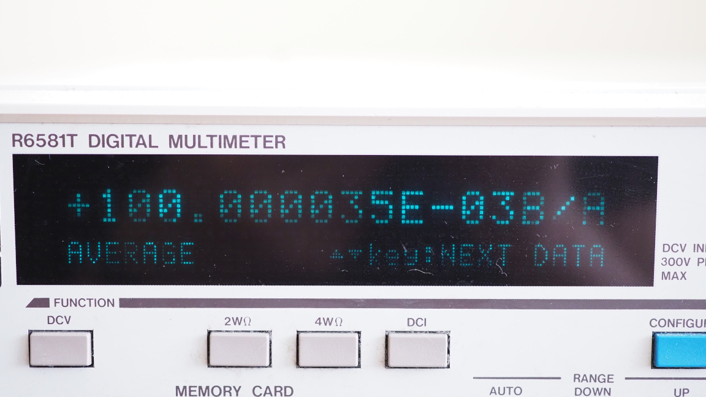

Kicad project for Hamon 1:10 Resistive Divider.

Resistor values can be calculated with the Hamon_calc.ods file.

The first prototype will use :
- S102K 5K resistors for R1-3 
- RCK02 for R4 - 1K8 and R5 - 22K
- Accutrim 1280G 1K trimmer
- 2 SA404 banana plugs for direct connection to the 10V LTZ1000 Voltage Reference Standard
- 2 Pomona 3750 binding posts for cable connection to the DMM
- DPST switch M2021SS1W01 with low contact resistance

Files: 
hamon.kicad\_pcb - hamon divider PCB with 2 banana plugs (SA404) and 2 binding posts. 
hamon\_bp.kicad\_pcb - hamon divider PCB with 4 binding posts. 
Hamon\_calc.ods - spreadsheet for resistor calculation. 

Images of the prototype:

Preliminary test:

Input 10V LTZ1000 based voltage reference.
Output 1V
Ratio 1:10 -> 0.1

Setup with Advantest R6581T:

Setup with HP 34401A:

Test with 50 samples (50 samples x 8 sec = 400 sec.) for noise:

STDEV = 0.000 000 012

Min-Max value = 0.000 000 061

Average value = 0.100 000 014

Test with 450 samples for stability:

450 samples - 1 hour. Temp 21.6 - 22.1 C, 39-42 % RH

STDEV = 0.000 000 015

Min-Max value = 0.000 000 086

Average value = 0.100 000 035

