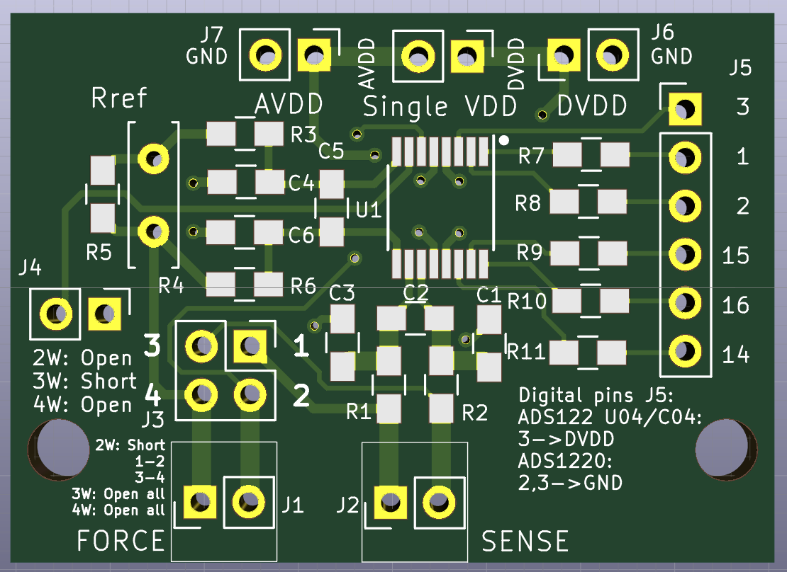
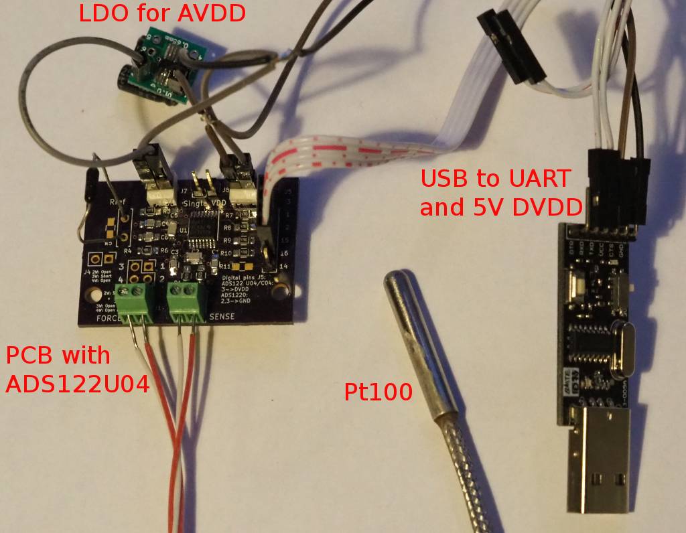

This is a PCB for ADS1220, ADS122U04 and ADS122C04 ICs from TI.

The PCB can be used as digital thermometer front-end with PT100 platinum resistance sensor.

The Pt100 sensor can be connected in 2,3,4 wire configuration.

The achievable resolution is 0.001C when 1mA current is used with averaging 20 samples per second.

The achievable uncertainty for 1 year, using a reference resistor with stability <25ppm per year and TCR < 2.5/C can be 0.02C (K=2).

The ADS122x IC have two power supplies - analog AVDD and digital DVDD. This version of PCB have common ground between AVDD and DVDD.

The common ground between AVDD and DVDD limits the temperature range to -20 <-> 145C ( min AVDD = 4V, PGA = 16, Rref = 2.5K).

The PCB can fit into BERNIC ABS box type 40x. 

